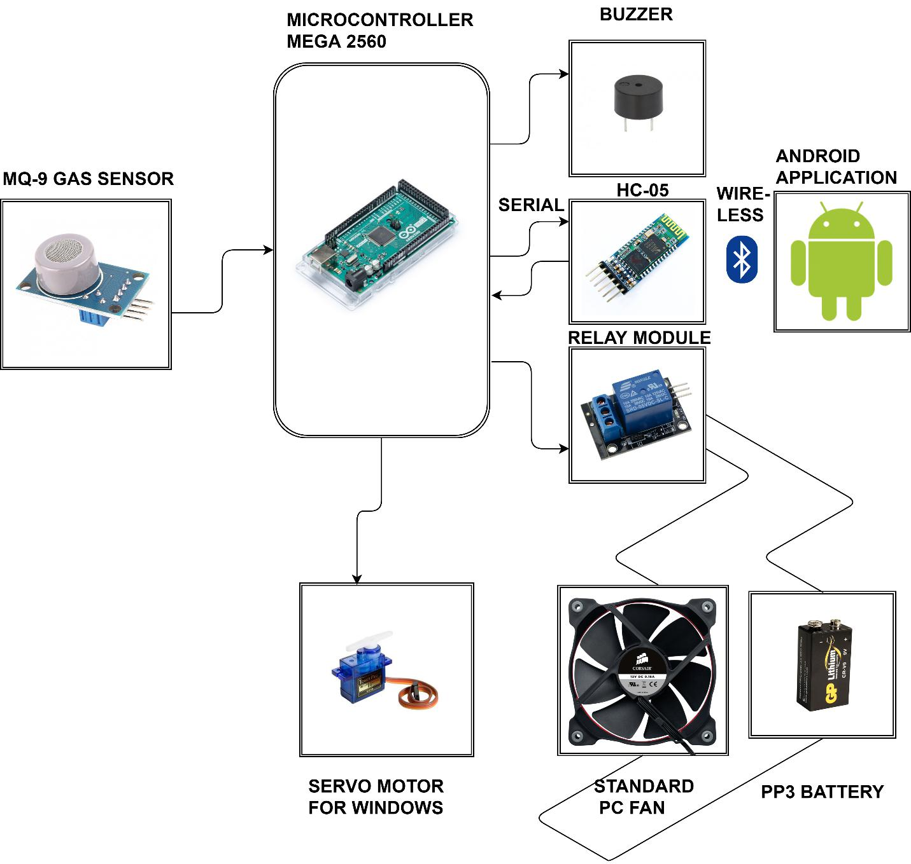
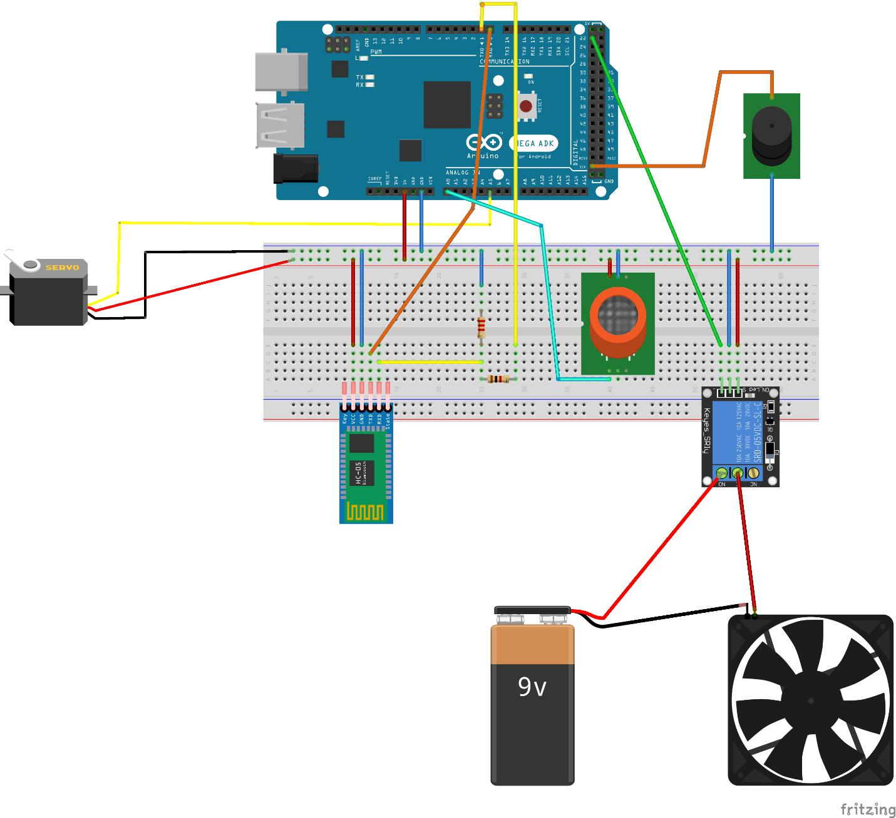

This project is meant  control and monitor arduino based Gas Detection System.

#### How to compile the android app:
1. - Open android studio on the directory /AndroidAPP
2. - Wait for it to Import Modules/Gradle build
3. - Go to Build and click on Rebuild Project
4. - Now you can generate APK by going to Build->Build Bundle ->Build APK

#### You can easily adapt the project to your needs as follows:
###### Android Application Side :
1. - modifying `processReceivedDataAndRefreshDisplay()` method in Control.java which controls what happens with data received in the app from arduino
2. - using the `sendData()` method in Control.java  which sends strings to arduino (commands) 
3. - also MAKE SURE that the strings are EXACTLY 5 charachters long

###### Arduino Side:
1. -  make sure you have atleast a delay of 200ms in the loop  `delay(200);`
2. -   and the strings you send out with Serial.write are EXACTLY 5 charachters long
3. -   also you should only send one string at a time in the loop cycle

#### Project Diagram

#### Arduino Schematic

